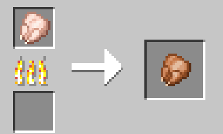
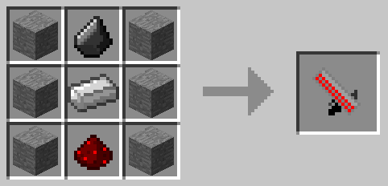
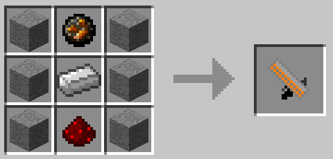
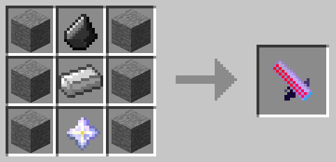
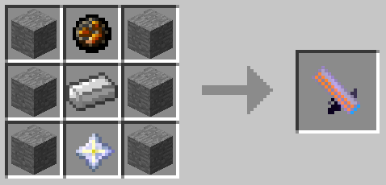
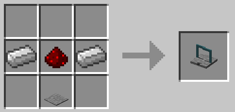

# Explosive Chickens 2: Revenge of the Fowl

## This mod requires [Fabric API](https://www.curseforge.com/minecraft/mc-mods/fabric-api)

This mod is the official remake of the [Explosive Chickens mod](https://www.planetminecraft.com/mod/minecraftforge-explosive-chickens-152/) I made back in 2013. I wanted to bring this mod back to life and extend it, with a focus on making the mod more survival-friendly and add some more options for PvP combat.

- **Exploding Chicken Mob**
  - Chicken with blue dots on wattle
  - Explodes on contact with player or at chance when damaged (unless hit with Silk Touch)
  - Can have fireworks attached to them by right clicking, and then launched by right clicking with Flint and Steel
  - Lays fake eggs, drops fake raw chicken when killed
- **Fake Eggs and Chicken Items**
  - These items have the same name and texture as their vanilla counterparts
  - Fake Eggs laid by chickens explode when used and can be shot by dispensers
  - Fake chicken can be cooked in furnace, smoker or campfire and explodes when eaten
- **Chicken Launchers**
  - Launcher item which shoots fake eggs that explode on impact
  - Featuring 3 new variants:
    - Incendiary: shoots eggs which light the area aflame
    - Incubating: shoots fully grown chickens for a much larger explosion radius
    - Incendiary Incubating: a devestating combination of the two
- **Chicken Armor**
  - Adds new helmet, chestplate, leggings and boots crafted from raw chicken meat
  - Armor causes an explosion upon your death, adding a chance for a sweet revenge in PvP battles
  - Armor can be cooked by being in your inventory while you are on fire
- **Chicken Trap**
  - New block which traps exploding chickens when they walk onto them
  - Chicken cannot be exploded by contact while trapped
  - Providing a redstone signal to the trap block immediately explodes the chicken
- **Plus some other small features**
  - See if you can spot them

All recipes can be unlocked in the Recipe Book by obtaining certain required items.

Cooked Chicken

### Furnace/Smoker/Campfire

Chicken Launcher Variants

### Normal Launcher

### Incendiary Launcher

### Incubating Launcher

### Incendiary Incubating Launcher

Chicken Armor

### Chicken Helmet

### Chicken Chestplate

### Chicken Leggings

### Chicken Boots

Chicken Trap

- Restore taming functionality from original mod
- More chicken variants
- Something challenging...
